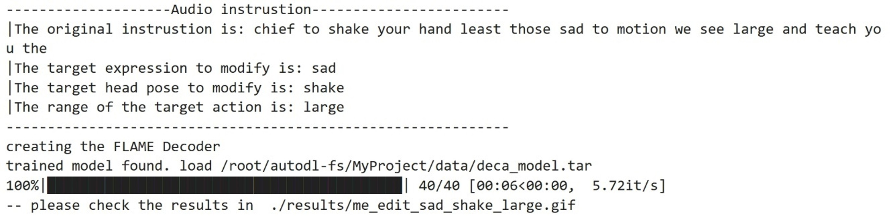
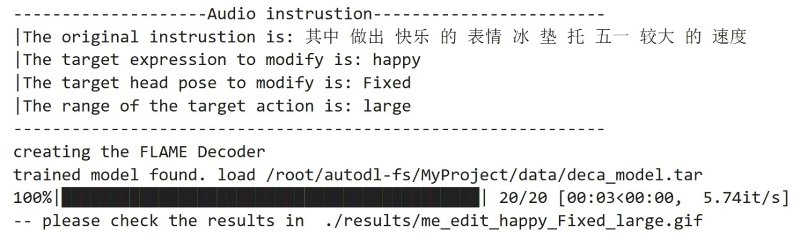
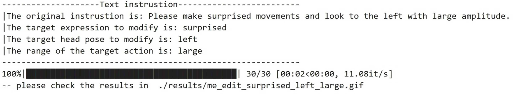
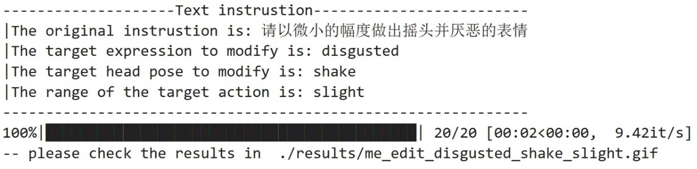
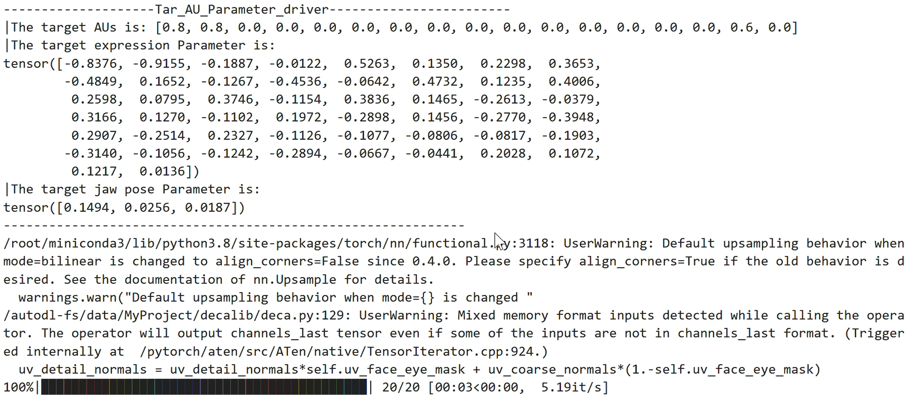

# Command-driven 3D face animation generation from in-the-wild image

The code is implemented mainly in Python language. 

## Requirements
To build the environment, you can follow the ipynb file **./setupImport.ipynb**, but first you need to follow [DECA: Detailed Expression Capture and Animation (SIGGRAPH 2021)](https://github.com/yfeng95/DECA) to build the baseline environment, then you can use the following instruction or the method written in **setupImport.ipynb** to build the rest environment. 

To build the environment you can run 
```bash
pip install -r requirements.txt
```

## Getting Started
There are five way to generate the 3D animation result. By using audio instruction (EN/CH), text instruction (EN/CH), single image, video sequence and action unites (AUs).

### Audio instruction
The running demo shows in **./Audio-Example.ipynb**, you can follow the ipynb settings to run the code.

#### English Audio instruction
<p align="center"> 
    
</p>  
<p align="center">Running screenshot for audio command in English<p align="center">
<p align="center"> 
    
</p>  
<p align="center">Generation result for audio command in English<p align="center">

#### Chinese Audio instruction
<p align="center"> 
    
</p>  
<p align="center">Running screenshot for audio command in Chinese<p align="center">
<p align="center"> 
    
</p>  
<p align="center">Generation result for audio command in Chinese<p align="center">

### Text instruction
The running demo shows in **./Text-Example.ipynb**, you can follow the ipynb settings to run the code.
#### English Text instruction
<p align="center"> 
    
</p>  
<p align="center">Running screenshot for text command in English<p align="center">
<p align="center"> 
    
</p>  
<p align="center">Generation result for text command in English<p align="center">

#### Chinese Text instruction
<p align="center"> 
    
</p>  

<p align="center">Running screenshot for text command in Chinese<p align="center">
<p align="center"> 
    
</p>  
<p align="center">Generation result for text command in Chinese<p align="center">

### Image instruction
The running demo shows in **./Single_image_driver-Example.ipynb**, you can follow the ipynb settings to run the code.

<p align="center"> 
    
</p>  
<p align="center">Generation result for image driven<p align="center">

### Video instruction
The running demo shows in **./Video_sequence_driver-Example.ipynb**, you can follow the ipynb settings to run the code.

<p align="center"> 
    
</p>  
<p align="center">Generation result for video driven<p align="center">

### AUs instruction
The running demo shows in **./AUs-Example.ipynb**, you can follow the ipynb settings to run the code.
<p align="center"> 
    
</p>  
<p align="center">Running screenshot for AUs command<p align="center">
<p align="center"> 
    
</p>  
<p align="center">Generation result for AUs command<p align="center">
